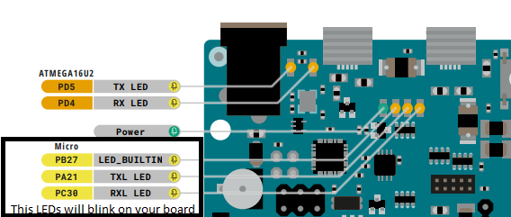

Based on repository: https://github.com/sdroege/arduino-due-rust

## Pin Mappings

Following this documentation: https://docs.arduino.cc/hacking/hardware/PinMappingSAM3X

| Due Pin Number | 	SAM3X Pin Name | 	        Mapped Pin Name	        | 
|----------------|-----------------|----------------------------------|
| 13	            | PB27	           | Digital Pin 13 / Amber LED "L"	3 |
| 72             | 	PC30	          | LED "RX"	15                      |
| 73	            | PA21	           | LED "TX"                   3     |	

Where: 
* PB = PIOB
* PC  = PIOC
* PA = PIOA

## General documentation

* atsam3x8e-wrap dependency, in order to communicate with hardware a special wrapper has been used 
(so we do not need to deal with hardware itself), this wrapper has been generated 
by using the tool svd2rust which converts a CMSIS-SVD to generated rust code
* memory.x file - Needed by cortex_m_rt crate, its has to be compiled in order to provide the memory layout of the target device
the referring values can be found on official arduino
product page.

| Specification | Value                                           |
|---------------|-------------------------------------------------|
| Flash Memory  | 	512 KB all available for the user applications |
| SRAM	         | 96 KB (two banks: 64KB and 32KB)                |

## Build steps on Windows: 
* cargo objcopy --bin app --target thumbv7m-none-eabi --release -- --output-target=binary image.bin
* Connect your arduino due to your pc through your programming port (Micro-USB) 
  * Click on the Start Menu and open the Control Panel
    Navigate to “System and Security”. Click on System, and open the Device Manager.
    Look for the listing named “Ports (COM & LPT)”, then look for
    Usb Serial Device. And replace 'com3' with your port name
    * mode com3:1200,n,8,1
* bossac -e -w -v -b -R image.bin

All 3 steps must be executed everytime you may want to apply code updates